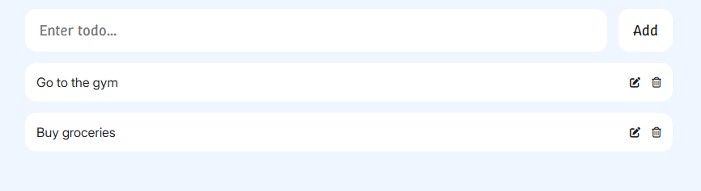

# To Do List

The **To Do List** project is a personal initiative to demonstrate the core concepts of **React**, **HTML**, **CSS**, and **JavaScript**. This project showcases the creation of a responsive and interactive task management application, focusing on modern web development practices.

---

## 🚀 Features

- **Task Management**: Add, edit, delete, and mark tasks as complete.
- **Dynamic Updates**: React-powered updates for seamless user interaction.
- **Responsive Design**: Optimized for both desktop and mobile devices.
- **Local Storage**: Saves tasks persistently in the browser.

---

## 📂 Project Structure

The project is structured as follows:

```
.project-root/
│── .gitignore          # Plik ignorujący pliki dla Git
│── eslint.config.js    # Konfiguracja ESLint
│── index.html          # Główny plik HTML
│── LICENSE             # Plik licencji
│── package.json        # Plik konfiguracji npm
│── README.md           # Dokumentacja projektu
│── vite.config.js      # Konfiguracja Vite
│
├── public/             # Pliki statyczne
│
├── src/                # Główne źródła aplikacji
│ │── App.jsx           # Główny komponent aplikacji
│ │── index.css         # Globalne style CSS
│ │── main.jsx          # Punkt wejściowy aplikacji
│ │
│ ├── components/       # Folder z komponentami
│ │ │── TodoCard.jsx    # Komponent karty zadania
│ │ │── TodoInput.jsx   # Komponent pola wprowadzania zadań
│ │ └── TodoList.jsx    # Komponent listy zadań
```

---

## 🛠️ Technologies Used

- **React**: A JavaScript library for building user interfaces.
- **Vite**: A fast build tool and development server.
- **CSS**: For styling the application.
- **LocalStorage**: For persisting data in the browser.
- **Google Fonts**: For modern typography.
- **Material Icons**: For intuitive icons.

---

## 🌟 Key Functionalities

1. **Add Tasks**:

   - Users can add new tasks with a title.

2. **Edit Tasks**:

   - Modify existing tasks to update their details.

3. **Delete Tasks**:

   - Remove tasks from the list.

4. **Persistent Storage**:
   - Tasks are saved in the browser's local storage to retain data between sessions.

---

## 📸 Screenshots

### Main Interface



---

## ⚙️ Installation and Usage

1. Clone the repository:
   ```bash
   git clone https://github.com/Xelo04/To-Do-List
   cd To-Do-List
   ```
2. Install dependencies:
   ```bash
   npm install
   ```
3. Start the development server:
   ```bash
   npm run dev
   ```
4. Open the app in your browser at http://localhost:5173.

---

## 🤝 Contributing

Contributions are welcome! If you have suggestions or improvements, feel free to fork the repository and submit a pull request.

---

## 📜 License

This project is under the MIT License - see the [LICENSE](./LICENSE) file for details.
